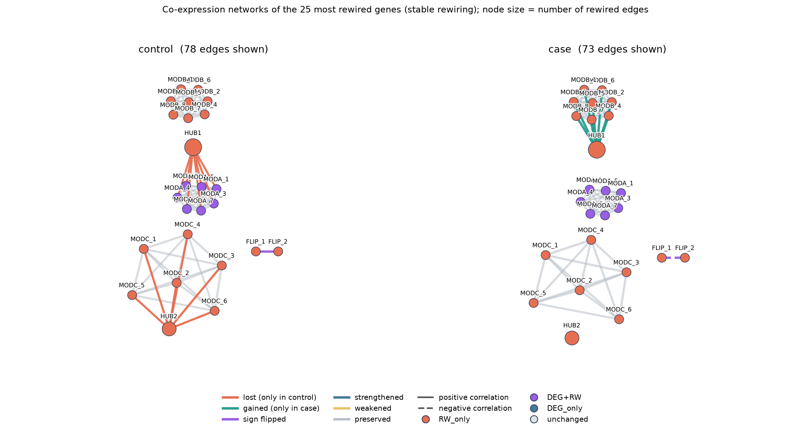

# RewireNF


**Idiomas:** [English](README.en.md) · Português

Pipeline Nextflow modular para identificar co-expressão gênica diferencial e *rewiring* de redes entre duas condições biológicas.

O RewireNF responde a esta pergunta: quais genes mudam suas **relações** com outros genes entre as condições, mesmo quando a expressão média deles não muda?

> **Status:** v1.1.

## Visualizando o rewiring



Dataset de demonstração (`data/demo/`, gerado por `bin/make_demo_data.py`): os mesmos genes ficam nas mesmas posições nas duas condições. O **HUB1** está ligado ao módulo A no `control` e passa para o módulo B no `case`, com o mesmo grau e a mesma expressão média, então a expressão diferencial não o enxerga. O **HUB2** perde todos os parceiros e o **FLIP_1/FLIP_2** inverte o sinal da correlação (linhas tracejadas são correlações negativas). Cores das arestas: vermelho = perdida, verde = ganha, roxo = sinal invertido, cinza = preservada. A figura é gerada pela pipeline (`figures/rewiring_network.png` e `.svg`) e incluída no `report.html`; o relatório completo do demo está em `docs/demo/report.html`.

Para reproduzir:

```bash
python bin/make_demo_data.py
nextflow run main.nf \
    --expression data/demo/expression.tsv \
    --metadata data/demo/metadata.tsv \
    --group_a control --group_b case \
    --min_logfc 0.5 \
    --outdir results/demo
```

## O que a pipeline faz

A partir de uma matriz de expressão normalizada e dos metadados das amostras:

1. **VALIDATE_INPUTS**: confere arquivos, correspondência entre amostras, duplicatas, valores ausentes e infinitos, variância zero e tamanho dos grupos (avisa quando n < 30).
2. **PREPROCESS**: remove genes com muitos valores ausentes ou variância zero, imputa os NAs restantes, mantém os genes mais variáveis (variância média dentro dos grupos, para não favorecer genes diferencialmente expressos) e separa os grupos.
3. **BUILD_NETWORK**: calcula correlações, p-valores e FDR (Benjamini-Hochberg) para todos os pares de genes em cada grupo. Uma aresta existe quando |r| ≥ `min_cor` e FDR < `fdr`.
4. **DIFFERENTIAL_NETWORK**: compara as duas redes com o teste z de Fisher e classifica cada aresta em `PRESERVED`, `GAINED`, `LOST`, `STRENGTHENED`, `WEAKENED` ou `SIGN_FLIPPED`; resume as mudanças por gene.
5. **TOPOLOGY**: calcula grau, força, betweenness, closeness, centralidade de autovetor e clustering por gene em cada rede (com as diferenças entre grupos) e o *neighbor turnover* (1 − Jaccard dos vizinhos).
6. **BOOTSTRAP**: reamostra as amostras de cada grupo com reposição e mede com que frequência cada aresta candidata reaparece. Combinado com o teste diferencial, separa o rewiring bruto do **rewiring estável** (`bootstrap_support >= stability_threshold`).
7. **DIFFERENTIAL_EXPRESSION** e **INTEGRATE_DE_RW**: roda o limma nos genes analisados e cruza o resultado com o rewiring estável, classificando cada gene em `DEG+RW`, `RW_only` (rewiring sem expressão diferencial), `DEG_only` ou `unchanged`.
8. **COMMUNITIES**: detecta módulos (Louvain) em cada rede e marca os genes cujo módulo muda entre as condições.
9. **ENRICHMENT** (opcional): enriquecimento funcional das listas de genes com rewiring, usando seus próprios conjuntos de genes e/ou GO/KEGG humano.
10. **PLOT_NETWORK**: figura das redes dos genes mais rewired, uma por condição, com os mesmos genes nas mesmas posições.
11. **EXPORT_NETWORK**: grava arquivos GraphML para o Cytoscape.
12. **REPORT**: gera um `report.html` autocontido, com cartões de resumo, figuras e tabelas de cada etapa.

## Entrada

- `expression.tsv`: genes nas linhas e amostras nas colunas, com o ID do gene na primeira coluna. Espera valores contínuos já normalizados (log2(TPM+1), logCPM, VST), não contagens brutas.
- `metadata.tsv`: uma linha por amostra, com a coluna `sample` e uma coluna de agrupamento (padrão `condition`).

## Início rápido

```bash
nextflow run main.nf -profile test
```

Roda a pipeline no dataset sintético (`data/example/`), gerado por `bin/make_example_data.py`, em que o resultado esperado é conhecido.

Nos seus dados:

```bash
nextflow run main.nf \
    --expression data/expression.tsv \
    --metadata data/metadata.tsv \
    --group_col condition \
    --group_a control \
    --group_b disease \
    --method pearson \
    --min_cor 0.6 \
    --fdr 0.05 \
    --outdir results
```

## Parâmetros

| Parâmetro | Padrão | Descrição |
|---|---|---|
| `--expression` | obrigatório | Matriz de expressão (TSV) |
| `--metadata` | obrigatório | Metadados das amostras (TSV) |
| `--group_col` | `condition` | Coluna dos metadados com os grupos |
| `--group_a`, `--group_b` | obrigatório | Os dois grupos a comparar |
| `--method` | `pearson` | `pearson` ou `spearman` |
| `--min_cor` | `0.6` | \|r\| mínimo para existir uma aresta |
| `--fdr` | `0.05` | Limiar de FDR |
| `--top_variable_genes` | `3000` | Número de genes mais variáveis mantidos |
| `--bootstrap` | `100` | Número de repetições do bootstrap |
| `--bootstrap_seed` | `42` | Semente aleatória do bootstrap |
| `--stability_threshold` | `0.8` | Suporte mínimo do bootstrap para rewiring estável |
| `--run_de` | `true` | Roda o limma e a integração DE × rewiring |
| `--de_fdr` | `0.05` | Limiar de FDR da expressão diferencial |
| `--min_logfc` | `0` | \|logFC\| mínimo para chamar um gene de DEG |
| `--min_rewired_edges` | `1` | Arestas de rewiring estável para chamar um gene de rewired |
| `--community_resolution` | `1.0` | Resolução do Louvain |
| `--community_seed` | `42` | Semente aleatória do Louvain |
| `--module_overlap_threshold` | `0.5` | Jaccard mínimo para considerar o módulo de um gene inalterado |
| `--run_enrichment` | `false` | Roda o enriquecimento funcional |
| `--organism` | nenhum | `human` ativa GO/KEGG |
| `--gene_sets` | nenhum | Seus conjuntos de genes (TSV com `term` e `gene`, ou `.gmt`) |
| `--gene_id_type` | `SYMBOL` | `SYMBOL`, `ENSEMBL` ou `ENTREZID` (humano) |
| `--run_kegg` | `true` | Inclui o KEGG no enriquecimento humano |
| `--enrich_fdr` | `0.05` | Limiar de FDR do enriquecimento |
| `--enrich_min_size`, `--enrich_max_size` | `5`, `500` | Limites de tamanho dos conjuntos de genes |
| `--enrich_min_overlap` | `2` | Mínimo de genes em comum para reportar um termo |
| `--run_report` | `true` | Gera o relatório HTML |
| `--plot_max_genes` | `40` | Número máximo de genes na figura das redes |
| `--container` | `rewirenf:latest` | Imagem usada com `-profile docker` |
| `--outdir` | `results` | Pasta de saída |

## Saídas

```
results/
├── qc/qc_report.tsv
├── preprocessing/filtered_expression.tsv
├── networks/                  # <grupo>_network.tsv
├── differential_network/      # differential_edges, gained_edges, lost_edges, sign_flips, gene_rewiring
├── topology/network_metrics.tsv
├── rewiring/                  # neighbor_turnover, stable_rewiring, de_vs_rewiring, category_summary
├── bootstrap/                 # edge_stability, gene_stability
├── differential_expression/DE_results.tsv
├── communities/               # gene_modules, module_summary
├── enrichment/                # gene_lists, custom_enrichment, GO, KEGG
├── figures/                   # rewiring_network.png e .svg
├── networks_graphml/          # <grupo_a>.graphml, <grupo_b>.graphml, rewiring.graphml
└── report.html
```

O `rewiring.graphml` traz, por gene, `degree_<grupo>`, `delta_degree`, `edges_gained`, `edges_lost` e `sign_flips`, e, por aresta, `status`, `delta_r` e `fdr_diff`.

## Enriquecimento funcional

Ativado com `--run_enrichment` (exige `--run_de true`). Cinco listas de genes são testadas para super-representação (teste hipergeométrico, FDR de Benjamini-Hochberg) contra um universo formado pelos genes que a pipeline analisou: `rewired_stable`, `RW_only`, `gained_connections`, `lost_connections` e `module_changed`.

- **Seus próprios conjuntos de genes (qualquer organismo):** `--gene_sets conjuntos.tsv`, um TSV com as colunas `term` e `gene` (ou um arquivo `.gmt`).
- **GO e KEGG humanos:** `--organism human` roda o clusterProfiler (GO BP/MF/CC e KEGG). Ajuste `--gene_id_type` para `SYMBOL` (padrão), `ENSEMBL` ou `ENTREZID`. O KEGG consulta o serviço web do KEGG; se ele não responder, a execução continua com a tabela de KEGG vazia (`--run_kegg false` pula essa parte).

```bash
nextflow run main.nf ... --run_enrichment --organism human --gene_sets meus_conjuntos.tsv
```

O caminho humano precisa de pacotes R instalados do Bioconductor (compilados, podem demorar):

```bash
bash scripts/install_r_deps.sh
```

## Rodando com Docker

O `Dockerfile` fixa Python, R, limma, clusterProfiler e org.Hs.eg.db, de modo que a pipeline inteira (inclusive o enriquecimento GO/KEGG humano) roda sem instalar mais nada:

```bash
docker build -t rewirenf:latest .
nextflow run main.nf -profile test,docker
```

Use `--container <imagem>` para rodar outra imagem.

## Exemplo de saída

`docs/example/` traz a saída da execução de teste no dataset sintético, e `docs/demo/` traz a do dataset de demonstração, incluindo o relatório HTML (`report.html`; baixe o arquivo e abra no navegador), as arestas diferenciais, as arestas de rewiring estável, a tabela DE × rewiring e o arquivo `rewiring.graphml` para o Cytoscape.

## Testes

O dataset sintético tem verdade conhecida (`data/example/truth.tsv`): GENE1–GENE2 é perdida, GENE1–GENE3 é ganha, GENE4–GENE5 inverte o sinal e GENE6–GENE7 é preservada. Depois de `nextflow run main.nf -profile test`, o comando abaixo roda todas as verificações:

```bash
bash tests/run_checks.sh
```

O GitHub Actions roda a pipeline a cada push, em dois workflows: `test` (rápido, no ambiente do runner) e `docker` (constrói a imagem e roda a pipeline e todas as verificações dentro dela, inclusive o enriquecimento GO humano).

## Ambiente de desenvolvimento

O repositório inclui um dev container (`.devcontainer/`) com Java, Python, R (limma) e Nextflow, que funciona no GitHub Codespaces sem instalar nada localmente. Dependências Python: pandas, numpy, scipy, statsmodels, networkx e matplotlib (versões fixadas em `requirements.txt`).

## Limitações

- Parte de uma matriz de expressão já processada, não de arquivos FASTQ. O limma assume dados em escala logarítmica.
- O teste z de Fisher é exato para a correlação de Pearson e apenas aproximado com Spearman.
- Redes de correlação estimadas com poucas amostras são instáveis; a validação avisa quando um grupo tem menos de 30 amostras.
- A estabilidade por bootstrap é calculada só para as arestas candidatas (presentes em pelo menos uma rede) e usa o limiar de |r| sem FDR, porque a reamostragem com reposição torna os p-valores otimistas demais.
- A anotação funcional embutida existe só para humano; outros organismos precisam de `--gene_sets`.
- A validação foi feita em datasets sintéticos com resposta conhecida. O desempenho e o comportamento em dados reais grandes ainda precisam ser avaliados.

## Roadmap

- v0.1 a v0.5 (concluídos): validação, redes, correlação diferencial, topologia, bootstrap, expressão diferencial, comunidades e enriquecimento.
- v0.6 (concluído): relatório HTML autocontido.
- v0.7 (concluído): imagem Docker e CI containerizado.
- v1.0 (concluído): documentação, arquivo de citação e saída de exemplo.
- v1.1 (concluído): figura das redes e dataset de demonstração.
- Ideias futuras: mais de duas condições, séries temporais, redes miRNA–mRNA e TF–alvo.

## Como citar

Se usar o RewireNF, cite-o com os metadados do `CITATION.cff` (o GitHub mostra em "Cite this repository").

## Licença

MIT
